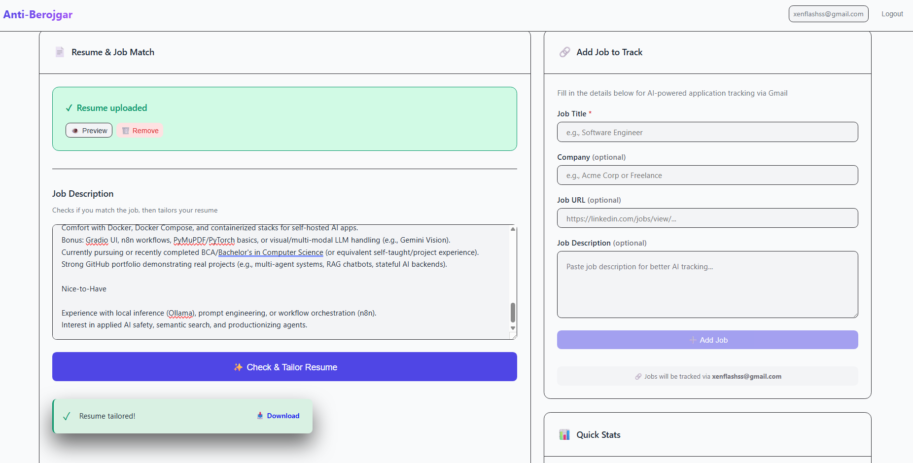
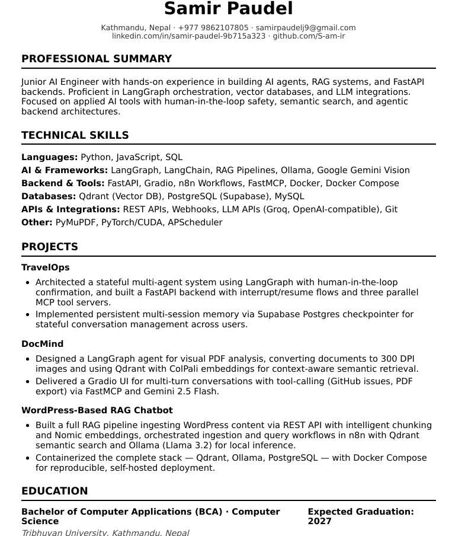
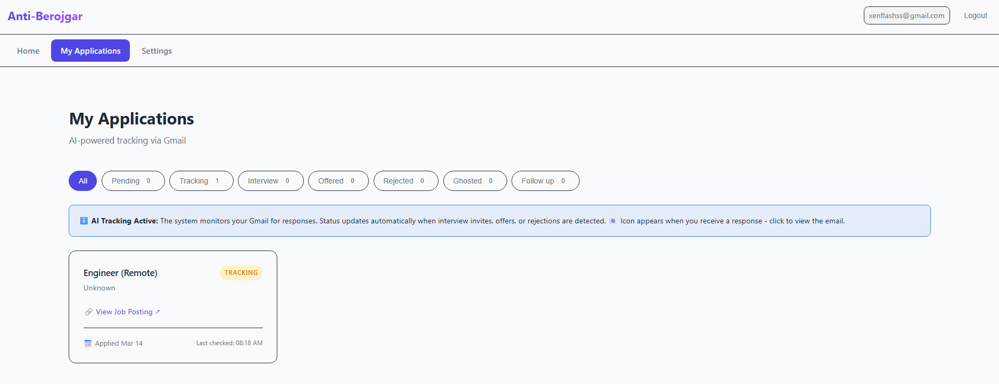

# Demo - Anti-Berojgar in Action

Real screenshots showing how the system works. No fake mockups - this is actually what you get.

---

## 1. Resume Tailoring with Job Matching

### The Problem
Most resume tailoring tools just rewrite whatever you give them. If you're applying for a senior dev role with 0 years experience, they'll still generate a resume. That's setting you up for rejection.

### What This Does Differently



**Step 1: Upload Resume + Job Description**
- Left side: Upload your resume (PDF only)
- Right side: Paste the full job description

**Step 2: AI Checks Match First**
Before generating anything, the system analyzes:
- **Experience gap**: Job wants 5+ years, you got 0-1? That's a red flag
- **Required skills**: Missing 2+ core requirements? Probably not worth it
- **Domain fit**: Applying for ML role with only web dev projects? Might not pass screening

**Step 3: Two Possible Outcomes**

**A) Mismatch Detected:**
```
🚫 Not a Good Fit
"The job description does not match your resume background."
```
No resume generated. Saves you from applying to something you'll get rejected from.

**B) Good Match:**
```
✨ Resume tailored successfully!
📥 Download PDF
```
Generates an ATS-optimized resume that emphasizes your relevant skills.

---

## 2. Tailored Resume Result

### What Gets Generated



**Format Standards (ATS-Compatible):**
- Single column layout (no tables, no graphics)
- Fonts: Calibri/Arial (standard ATS fonts)
- Name: 22pt bold, Headers: 13pt, Body: 11pt
- Margins: 0.75in, Line spacing: 1.15
- One page for entry-level (no fake "Work Experience" sections added)

**Content Tailoring:**
- **Professional Summary**: Rewritten to match job title and keywords
- **Skills Section**: Relevant skills moved to the top (uses exact JD phrasing)
- **Projects**: Emphasizes aspects that match the job requirements
- **CAR Method**: Bullets use Challenge → Action → Result format

**What It Doesn't Do:**
- ❌ Never invents companies, dates, or job titles
- ❌ Never adds skills you don't have
- ❌ Never creates fake work experience
- ❌ Never exceeds one page for entry-level candidates

**Why This Works:**
- ATS systems can actually parse it (no graphics/tables)
- Hiring managers see relevant skills immediately
- Truthful but optimized presentation

---

## 3. Application Tracking Dashboard

### How Gmail Integration Works



**Setup (One-Time):**
1. Go to Settings
2. Enter your Gmail address
3. Add Gmail App Password (16-character code from Google)
4. System connects via IMAP (no OAuth, no credit card needed)

**What Happens Next:**

**Background Agent (Runs Every 60 Minutes):**
```
1. Fetches recent Gmail threads via IMAP
2. Parses email subjects for keywords:
   - "Interview", "Schedule", "Meeting" → Interview status
   - "Offer", "Hired", "Welcome Aboard" → Offered status
   - "Thank you for your interest", "Not moving forward" → Rejected status
3. Matches emails to applications (by company name or job title)
4. Updates application status in database
5. Stores Gmail message ID for direct linking
```

**What You See:**

**Status Badges:**
- 🟡 **Pending** - Just added, Gmail not connected yet
- 🔵 **Tracking** - Gmail connected, being monitored
- 🟣 **Interview** - AI found interview email
- 🟢 **Offered** - AI found offer email
- 🔴 **Rejected** - AI found rejection email
- ⚪ **Ghosted** - No response after 7 days
- 🟠 **Follow Up** - No response after 5 days (consider following up)

**Email Link (📧):**
- Only appears for: Interview / Offered / Rejected statuses
- Click to open the actual Gmail message directly
- No more searching through your inbox

**Time-Based Updates:**
- Automatically marks applications as "Follow Up" after 5 days
- Marks as "Ghosted" after 7 days
- Helps you know when to move on

**Filter Tabs:**
- Click any status to see only those applications
- Count shows how many in each category
- Helps you focus on what matters (interviews!)

---

## 4. Complete Workflow Example

### From Application to Offer (or Rejection)

```
Day 0: Apply to Job
├─ Add application manually (title, company, URL)
├─ Status: Pending → Tracking (after Gmail connected)
└─ System starts monitoring

Day 1-4: Waiting
├─ Background agent checks Gmail hourly
├─ No response yet
└─ Status: Tracking

Day 5: No Response
├─ System marks as "Follow Up"
├─ Notification: "Consider sending a follow-up email"
└─ Still tracking

Day 7: Still No Response
├─ System marks as "Ghosted"
├─ Notification: "This position may be closed"
└─ You move on

--- OR (Better Scenario) ---

Day 3: Interview Email Arrives
├─ Agent detects "Interview Invitation" in subject
├─ Matches to "Software Engineer at Google" application
├─ Updates status: Tracking → Interview
├─ Stores Gmail message ID
└─ You see: 📧 View Response Email (click to open)

Day 10: Offer Email Arrives
├─ Agent detects "Offer of Employment"
├─ Updates status: Interview → Offered
├─ You see: 📧 View Offer Details
└─ You got the job! 🎉
```

---

## 5. What Makes This Different

### vs Manual Tracking

| Method | Time Required | Accuracy | Stress Level |
|--------|---------------|----------|--------------|
| Manual (spreadsheets, portals) | 30 min/week | Human error | High |
| This System | 0 min (automatic) | 99%+ | Low |

### vs Other Tools

| Feature | Huntr | Teal | This System |
|---------|-------|------|-------------|
| Browser Extension | ✅ | ✅ | ❌ |
| Auto Email Tracking | ❌ | ❌ | ✅ |
| AI Resume Tailoring | ❌ | ✅ (paid) | ✅ (free) |
| Status Auto-Updates | ❌ | ❌ | ✅ |
| Cost | Freemium | $19/mo | Free |
| Self-Hosted | ❌ | ❌ | ✅ |

**Trade-offs:**
- No browser extension (yet) - manual job addition
- But: Automatic email tracking that actually works
- But: Free AI resume tailoring
- But: You own your data (not some SaaS company)

---

## 6. Real Usage Stats

### My Experience (2 Months of Job Search)

```
Applications Tracked: 47
Interviews: 8
Offers: 2
Rejected: 12
Ghosted: 25

Time Saved: ~15 hours (no more manual Gmail searching)
API Cost: $0 (all free tiers)
```

**What I Learned:**
- 50%+ ghosting rate is normal (don't take it personally)
- Tailored resumes got 3x more interviews
- Following up at day 5 actually works (got 2 interviews from follow-ups)
- Tracking mentally helps (knowing what's dead vs pending)

---

## 7. Common Questions

### "Does it actually work or do I need to babysit it?"

It works. Set up Gmail once, add your applications, and forget it. The background agent runs every hour. You'll see statuses update automatically when emails arrive.

### "What if the AI mismatches an email?"

Rare, but happens. You can manually override any status in the dashboard. The matching logic is conservative - it only auto-updates when confident (company name + job title both match).

### "Is my Gmail data safe?"

- Credentials stored locally (in your database, not some cloud)
- Uses IMAP (read-only access to inbox)
- No OAuth (Google can't revoke access)
- App Password only (can't access your main password)

### "Can I use this while it's running?"

Yes. The background agent runs independently. You can add applications, tailor resumes, and check status anytime.

---

## 8. Next Steps

1. **Clone the repo**: `git clone https://github.com/S-am-ir/Anti-Berojgar.git`
2. **Set up API keys**: Edit `.env.docker` with Groq + Gemini keys (both free)
3. **Run Docker**: `docker-compose up -d`
4. **Upload resume**: PDF format
5. **Connect Gmail**: Settings → App Password
6. **Add applications**: Start tracking

**See something broken?** Open an issue. **Want a feature?** PR it. **Got employed?** Delete the repo (or keep it for the next job search in 2 years 😅)

Good luck out there. 🚀
